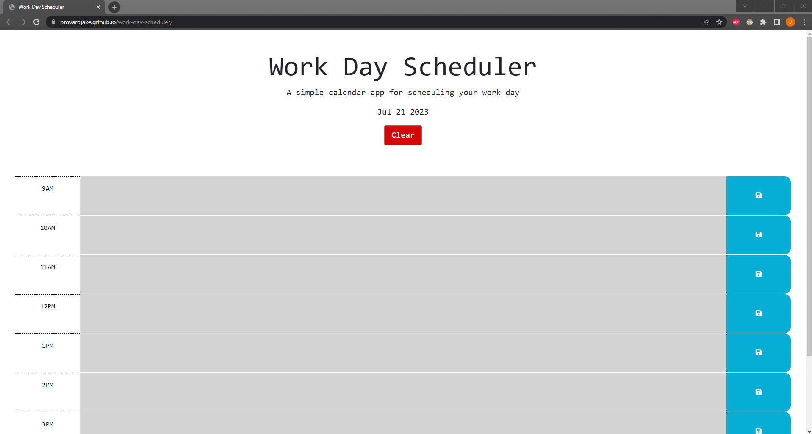

# work-day-scheduler
This is a simple planner application that allows the user to schedule their day during work hours. The user inputed data will save to local storage and persist until the clear button is clicked

# Screenshot of deployed application

# URL to deployed applicaiton
https://provardjake.github.io/work-day-scheduler/